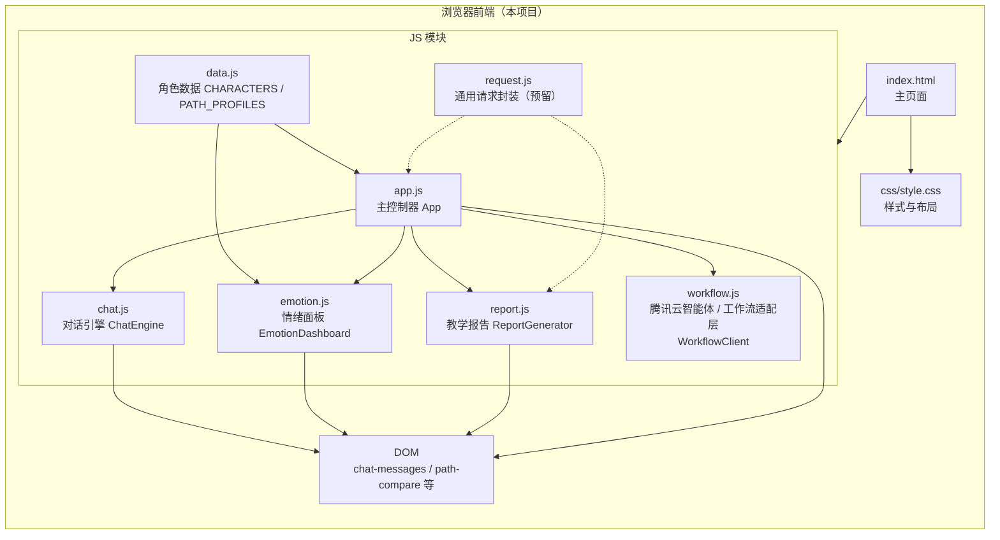
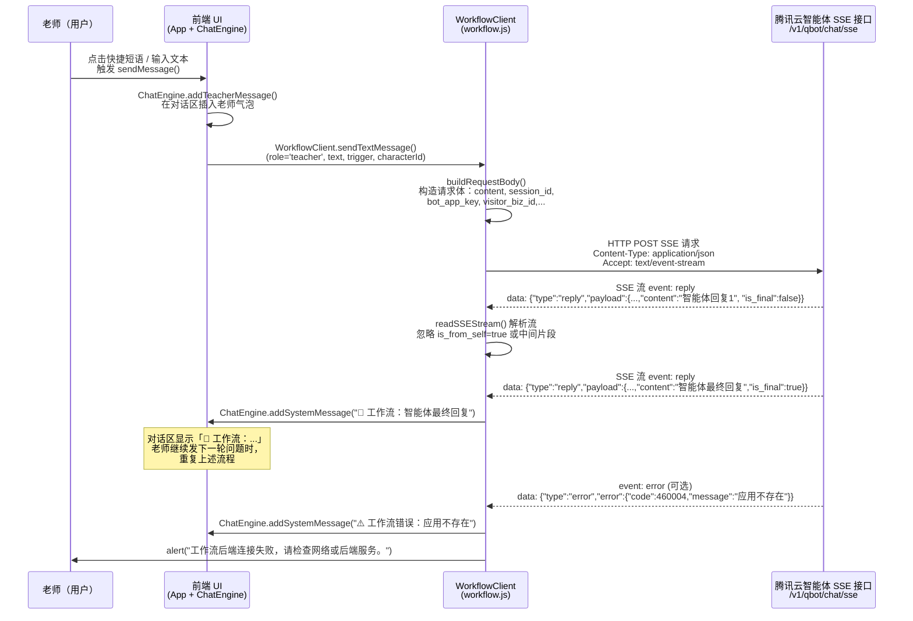

# 师范生数字学生仿真训练系统（前端）

本项目是计算机设计大赛用的「师范生数字学生仿真训练系统」前端部分，主要实现：

- **数字学生人格仿真**：支持多种学生人格（调皮型、内向型、学困型）的人机对话模拟。
- **情绪与路径分析**：实时监控对话中的情绪波动、教学策略比例，并给出个性化训练路径提示。
- **教学报告生成**：根据对话内容生成多维教学报告。
- **AI 工作流接入**：支持接入腾讯云智能体 HTTP SSE 接口，将前端对话流入智能体/工作流，并在前端展示回复。

---

## 一、配置文件说明（后端 / 仿真配置）

项目根目录下有多份学生配置文件，用于定义数字学生的人格与情绪参数（示例，具体以实际文件为准）：

- `config_zhangyiming.json`：调皮男生（张一鸣 / 闹闹）
- `config_linnuan.json`：内向女生（林暖暖 / 默默）
- `config_lidazhi.json`：学困男生（李大志 / 大志）
- `config_example_student.json`：模板示例，**不要修改**，用于参考字段含义

通用结构（简化示例）大致为：

```json
{
  "student_id": "dazhi",
  "name": "李大志",
  "nickname": "大志",
  "grade": "初二",
  "subject": "数学",
  "personality": {
    "openness": 0.3,
    "conscientiousness": 0.4,
    "extraversion": 0.2,
    "agreeableness": 0.6,
    "neuroticism": 0.8
  },
  "emotion_state": {
    "baseline_valence": 0.3,
    "baseline_arousal": 0.4
  },
  "memory": {
    "collection_name": "student_dazhi_memory"
  },
  "dialogue_profile": {
    "speaking_style": "简短、犹豫",
    "typical_behaviors": ["容易泄气", "经常说自己做不到"]
  }
}
```

### 1.1 必填 / 可调 / 禁改字段建议

- **需要填写**（每个学生都要有，且与现实设定匹配）：
  - `student_id`：内部使用的唯一 ID，建议与前端角色 ID 一致（如 `yiming` / `xiaorou` / `dazhi`）。
  - `name` / `nickname`：学生姓名与称呼。
  - `grade` / `subject`：年级与主要学科，用于提示与报告生成。
  - `personality` 下五维（0.0–1.0）：用于驱动人格画像雷达图。
  - `emotion_state.baseline_valence` / `baseline_arousal`（0.0–1.0）：初始情绪位置。
  - `memory.collection_name`：区分不同学生的记忆集合名，避免混在一起。
- **可选调整**（根据项目需要微调）：
  - `dialogue_profile`（说话风格、典型行为描述）。
  - 额外的策略参数（如偏好鼓励/批评权重等）——视后台实现而定。
- **请勿修改**：
  - 模板文件 `config_example_student.json` 的字段结构和注释。
  - 如果后端已经约定了字段名/类型（如 `student_id`、`memory.collection_name`），不要改名或改类型，以免接口解析失败。

> 提示：配置文件通常 **不应提交到公共仓库**，请在 `.gitignore` 中排除真实配置或密钥文件，仅保留示例模板。

---

## 二、前端整体架构

前端采用纯 HTML + CSS + 原生 JS 架构，不依赖框架，便于快速部署与集成到其他系统。

### 2.1 入口与静态资源

- `index.html`：主页面入口（仿真教室 + 情绪/路径看板）。
- `css/style.css`：页面样式和响应式布局。
- `js/`：
  - `data.js`：前端内置的角色数据（CHARACTERS 等）。
  - `request.js`：后端 API 请求封装（预留）。
  - `chat.js`：对话引擎（打字机效果 + 内心 OS 展示）。
  - `emotion.js`：情绪面板与图表逻辑。
  - `report.js`：前端教学报告生成模块。
  - `app.js`：主控制器，串联所有模块。
  - `workflow.js`：与腾讯云智能体 HTTP SSE 接口/工作流交互的适配层。

---

## 三、前端模块设计

### 3.1 主界面布局（`index.html` + `css/style.css`）

页面采用三栏布局：

- **左侧：角色选择栏（sidebar）**
  - 角色卡片（头像 + 名称 +人格标签）。
  - 操作按钮：查看角色档案、结束并生成报告。
- **中间：对话区（chat-main）**
  - 头部：当前学生名称 + 人格标签 +「仿真对话中」状态。
  - 对话消息区：老师消息、学生消息、系统提示、工作流返回消息。
  - 输入区：快捷短语按钮 + 文本输入框 + 发送按钮。
- **右侧：数据分析看板（dashboard）**
  - 情绪状态与情绪条形图。
  - 个性化路径分析（不同教学策略实际比例 vs 理想比例）。
  - 五维人格画像雷达图。
  - 情绪波动曲线。

### 3.2 对话与状态管理（`js/app.js` + `js/chat.js`）

- `App`：主控制器（挂在 `window.App` 上）
  - 管理当前学生 `currentCharacter`、当前情绪 `currentEmotion`。
  - 负责绑定 UI 事件（角色切换、发送消息、查看档案、生成报告等）。
  - 维护会话 ID `sessionId`，用于标记当前仿真会话。
- `ChatEngine`：
  - 在 `init('chat-messages')` 时绑定消息容器。
  - `addTeacherMessage(text, trigger)`：显示老师消息，记录到 `history`，并调用工作流。
  - `generateStudentReply(trigger)`：根据触发类型，从预设对话中选择学生回复。
  - `addStudentMessage(reply, innerThought, char)`：学生气泡 + 内心 OS 动画。
  - `history` 结构示例：
    ```js
    {
      role: 'teacher' | 'student',
      text: '……',
      innerThought: '……',  // 学生时可选
      trigger: '鼓励' | '批评' | ...,
      timestamp: 1730000000000,
      characterId: 'dazhi' // 用于区分不同学生
    }
    ```
  - 不同人格拥有各自的对话记录：通过 `data-character-id` 属性和 `characterId` 字段，在切换学生时只展示当前学生的消息。

### 3.3 情绪与路径分析（`js/emotion.js`）

- 负责：
  - 根据对话中的 `emotionDelta` 更新愉悦度/激活度/焦虑度等指标。
  - 维护情绪时间序列，用于绘制情绪波动折线图。
  - 更新人格雷达图（使用 ECharts）。

### 3.4 教学报告生成（`js/report.js`）

- 根据 `ChatEngine.history` 和角色信息生成本次训练报告：
  - 统计轮次、教师/学生发言次数、持续时间。
  - 计算多维教学能力评分（共情、提问、耐心、应变、激励）。
  - 生成针对不同人格的改进建议与提示卡片。
  - 支持导出报告（如 JSON/文本，视实现而定）。

---

## 四、腾讯云智能体 / 工作流接入（`js/workflow.js`）

前端通过 HTTP SSE 接口对接腾讯云智能体（带工作流），文档参考：  
`[对话端接口文档（HTTP SSE）](https://cloud.tencent.com/document/product/1759/105561)`

### 4.1 基本配置

```js
const WORKFLOW_CONFIG = {
  endpoint: 'https://wss.lke.cloud.tencent.com/v1/qbot/chat/sse', // 官方 SSE 接口
  botAppKey: '你的 bot_app_key',   // 从「应用管理」->「调用」复制
  visitorBizId: 'teacher-001',    // 访客 ID，2-64 位 [a-zA-Z0-9_-]
  workflowStatus: 'enable',       // 未配置工作流时可改为 'disable'
  proxyUrl: '',                   // 浏览器跨域时填后端代理地址
};
```

> 安全建议：实际部署时不要把真实 `bot_app_key` 写死在前端代码里，可通过后端下发短期 token 或代理接口调用。

**连接不上时排查**（参考 [文档](https://cloud.tencent.com/document/product/1759/105561)）：

1. **应用已发布**：触发对话前需在腾讯云控制台将应用发布并处于运行状态。
2. **AppKey 正确**：在「应用管理」-> 该应用 ->「调用」中复制 bot_app_key，与 `WORKFLOW_CONFIG.botAppKey` 一致。
3. **session_id 合法**：2–64 位，仅含 `[a-zA-Z0-9_-]`；前端已做规范化，一般无需改。
4. **浏览器跨域（CORS）**：若控制台报 `Failed to fetch` / `NetworkError` 或跨域错误，说明腾讯云接口未允许当前页面域名。解决办法：用**后端代理**——前端请求你自己的后端，由后端再请求 `https://wss.lke.cloud.tencent.com/v1/qbot/chat/sse`，并把 `WORKFLOW_CONFIG.proxyUrl` 设为该后端地址。
5. **工作流未配置**：若应用未配置工作流，可将 `workflowStatus` 改为 `'disable'`，走标准对话。

### 4.2 请求体结构（与文档对齐）

`WorkflowClient.buildRequestBody(content, sessionId, customVariables)` 生成请求体：

```js
{
  request_id: "sess_xxx-1730000000000",
  content: "老师本轮发言内容",
  session_id: "sess_xxx",         // 与 App.sessionId 对应
  bot_app_key: WORKFLOW_CONFIG.botAppKey,
  visitor_biz_id: WORKFLOW_CONFIG.visitorBizId,
  incremental: false,
  streaming_throttle: 10,
  stream: "enable",
  workflow_status: "enable",
  custom_variables: {
    role: "teacher",
    characterId: "dazhi",
    trigger: "鼓励"
  }
}
```

### 4.3 SSE 流式回复解析与前端展示

- 使用 `fetch` + `response.body.getReader()` 解析 SSE 流。
- 仅关注：
  - `event: reply`：从 `payload.content` 里取最终回复文本，当 `is_from_self == false` 且 `is_final == true` 时，将内容以系统消息形式插入对话区：
    ```js
    ChatEngine.addSystemMessage(`🤖 工作流：${text}`);
    ```
  - `event: error`：解析错误信息并提示：
    ```js
    ChatEngine.addSystemMessage(`⚠️ 工作流错误：${msg}`);
    alert('工作流后端连接失败，请检查网络或后端服务。');
    ```

### 4.4 老师/学生消息上传策略

- 老师消息：
  - 调用 `WorkflowClient.sendTextMessage(sessionId, 'teacher', text, { trigger, characterId })`。
  - 由 `sendTeacherMessageToWorkflow` 触发 SSE 调用并显示回复。
- 学生消息：
  - 当前仅作为前端仿真显示，可选择是否上传到工作流（代码中已预留上传逻辑，默认也会上传，但不会触发新一轮 SSE 对话）。

### 4.5 curl 调用示例

接口地址与方式见 [对话端接口文档（HTTP SSE）](https://cloud.tencent.com/document/product/1759/105561)：**POST** `https://wss.lke.cloud.tencent.com/v1/qbot/chat/sse`，Body 为 JSON。

**必填参数**：`content`、`session_id`、`bot_app_key`、`visitor_biz_id`。  
**建议必填**：`request_id`（便于消息串联与排查）。  
**常用可选**：`incremental`、`streaming_throttle`、`stream`、`workflow_status`、`custom_variables`。

#### 方式一：直接 curl（替换 `你的bot_app_key` 和 `你的消息内容`）

```bash
curl -N -X POST 'https://wss.lke.cloud.tencent.com/v1/qbot/chat/sse' \
  -H 'Content-Type: application/json' \
  -H 'Accept: text/event-stream' \
  --data-raw '{
    "request_id": "req-'$(date +%s)'",
    "content": "你的消息内容",
    "session_id": "a29bae68-cb1c-489d-8097-6be78f136acf",
    "bot_app_key": "你的bot_app_key",
    "visitor_biz_id": "a29bae68-cb1c-489d-8097-6be78f136acf",
    "incremental": true,
    "streaming_throttle": 10,
    "visitor_labels": [],
    "custom_variables": {},
    "search_network": "disable",
    "stream": "enable",
    "workflow_status": "enable"
  }'
```

- `session_id` 需满足 2–64 位，仅 `[a-zA-Z0-9_-]`，可用 UUID 如 `1b9c0b03-dc83-47ac-8394-b366e3ea67ef`。
- 返回为 SSE 流，`event: reply` 的 `payload.content` 为智能体回复，`event: error` 为错误信息。

#### 方式二：使用项目内脚本（推荐）

本项目已配置统一 AppKey（见 `js/workflow.js` 中 `WORKFLOW_CONFIG.botAppKey`）。命令行测试可任选其一：

```bash
# 1）使用本地密钥文件（与前端一致）：复制示例并填入与 js/workflow.js 相同的 AppKey
cp scripts/.bot_app_key.example scripts/.bot_app_key
# 将 .bot_app_key 内「你的bot_app_key」改为实际密钥，保存后：
./scripts/call-sse.sh

# 2）或临时指定密钥与内容
export BOT_APP_KEY="你的bot_app_key"
./scripts/call-sse.sh
CONTENT="哪吒2票房" ./scripts/call-sse.sh
```

脚本会生成符合文档的 `request_id`、`session_id`，并带上 `Accept: text/event-stream` 与上述 body 字段；若系统有 `jq`，会对 `CONTENT` 做转义，避免特殊字符导致 JSON 错误。

---

## 五、开发与部署

### 5.1 本地开发

```bash
# 启动一个简单静态服务（Python 示例）
cd /path/to/项目根目录
python -m http.server 8000

# 浏览器访问
http://localhost:8000/index.html
```

> 直接用文件协议（`file://`）打开时，部分浏览器对跨域 / SSE 支持有限，推荐使用本地 HTTP 服务。

### 5.2 注意事项

- 请将真实的：
  - 学生配置文件（含真实学生信息）、
  - 腾讯云智能体 `bot_app_key`/其他密钥，
  **排除在 Git 仓库之外**，仅保留示例模板与空配置文件。
- 若需要扩展更多学生人格：
  - 在后端增加对应的配置 JSON；
  - 在 `js/data.js` 中补充 `CHARACTERS` 条目；
  - 确保 `student_id` / `characterId` / `memory.collection_name` 等字段保持一一对应。

---

## 六、架构与交互时序图

### 6.1 前端整体架构图




### 6.2 与腾讯云智能体 HTTP SSE 的调用时序

对应文档：`[对话端接口文档（HTTP SSE）](https://cloud.tencent.com/document/product/1759/105561)`




