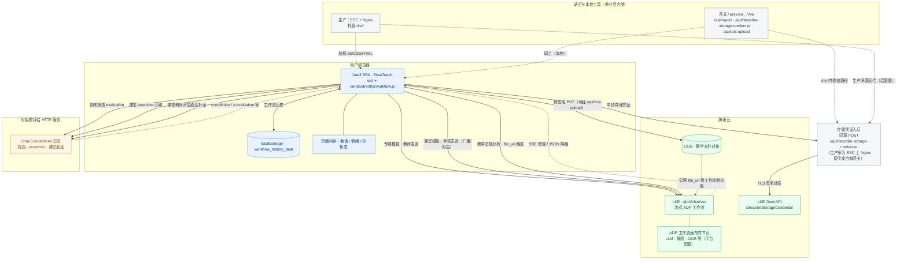

# SimuTeach 实际系统架构与数据流

> 本文档按 **`teacher-training-agent` 仓库真实实现**描述，**不再采用「五层抽象」**。更细的接口字段见 `docs/第7章-技术实现材料说明.md`。

---

## 1. 实际组成一览

| 位置 | 内容 | 代码或配置线索 |
|------|------|----------------|
| 用户浏览器 | Vue3 单页应用：专项模拟、课堂仿真、教学文档分析、报告与情绪 UI | `src/`、`vendor/front/js/workflow.js` |
| 用户浏览器 | 工作流对话历史本地缓存 | `localStorage` 键 `workflow_history_data` |
| 腾讯云 | 智能体对话 **SSE**：专项、课堂手动链、文档分析（`content`/`message` 为 `file_url`） | `https://wss.lke.cloud.tencent.com/v1/qbot/chat/sse`，`bot_app_key` 等见 `.env.example` |
| 腾讯云 | **DescribeStorageCredential**（上传前凭证）、**COS** 存教学文件 | `TeachingDocAnalysis.vue`、`vite.config.js` 中 `/api/describe-storage-credential`、`/api/cos-upload` |
| 对接方 HTTP | **Chat Completions 形态**：训练报告、`proactive` 主动轮询、课堂部分直连补全 | `VITE_REPORT_HTTP_URL` 等，`App.vue`、`ClassroomSim.vue`、`reportEvaluation.js` |
| 交付侧（可选） | **阿里云 ESC**：托管 `npm run build` 的 `dist/`，生产建议 **Nginx** 同源反代 `/api/report`、凭证代理等 | `README.md`、`.env.example` 顶部说明 |

**说明**：`vite.config.js` 里的 `/api/describe-storage-credential`、`/api/cos-upload` 仅在 **开发 / `vite preview`** 下随 dev server 生效；生产若仍需要浏览器侧调 OpenAPI，应在 ESC 上提供**等价网关**或改为自有后端签发凭证。

---

## 2. 总体架构图（按真实调用关系）

> **实线**：业务请求与数据读写；**虚线**：静态资源加载、工作流平台内部编排（前端不可见细节）。

---

## 3. 教学文档上传（实际顺序）

1. 前端请求 **DescribeStorageCredential**（开发环境常走 `POST /api/describe-storage-credential`）。  
2. 使用返回的 **预签名 URL** 向 **COS** **PUT** 文件（跨域受限时可走 `POST /api/cos-upload` 代理）。  
3. 得到 **`file_url`** 后，通过 **qbot SSE** 将 URL 写入 `content`/`message` 触发文档分析工作流。

---

## 4. 与常见「材料版架构」的差异（一句话）

本仓库**无**自带 FastAPI / Qdrant 源码；对话与编排主要在 **腾讯云 LKE/ADP** 侧，报告与部分课堂能力走 **独立 HTTPS 评估接口**。
